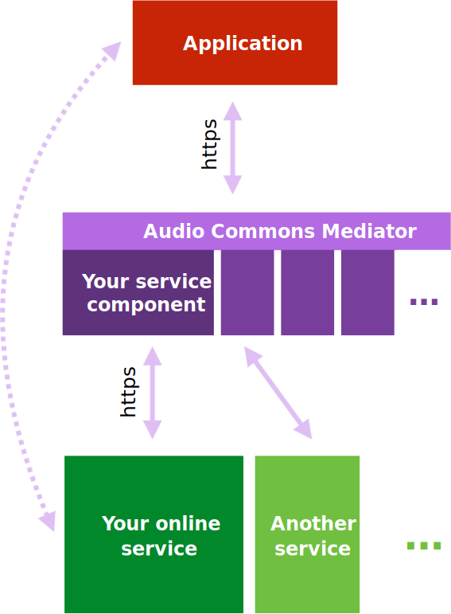

Audio Commons Services documentation
====================================

Here you'll find documentation and guidelines for making your existing online audio services available in the
**Audio Commons Ecosystem** (ACE).

In the ACE, *all* accesses to your service (and to any other third party service) will be done thorough the
**Audio Commons Mediator**. The applications that use Audio Commons services will interact with the mediator using
the **Audio Commons API**, and the mediator will then interact with the services and deliver results back to the
application (see diagram on the right).

To be able to do that, the Audio Commons Mediator needs to know some details about third party services so that
incoming requests can be **interpreted and properly distributed** across the range of available services.

For some specific functionalities like audio **download** and **upload**, applications will directly connect with
services without passing through the mediator (see dotted arrow in the diagram on the right), but the mediator will
still provide instruction on how to access the services.

In order to make service available in the ACE you'll have to implement the Audio Commons Mediator component that will
deal with the **translation of requests and interpretation responses** of your specific service API to make it
compatible with the Audio Commons API. In order for this component to be plugged into the Audio Commons Mediator,
it must be implemented in Python using the ``acservice`` package that we provide.

Using the ``acservice`` package
-------------------------------

Checkout the `Guidelines for implementing a new service component <https://www.audiocommons.org/assets/files/AC-WP2-UPF-D2.6%20Service%20Integration%20Draft%20Guidelines.pdf>`_
which describe how to implement a service using the ``acservice`` package. What's provided next is the source code
documentation of ``acservice`` package.

.. toctree::
   :maxdepth: 2

   acservice

.. tip:: For a quick overview of how it works, check out the `example implementation for the Freesound <https://github.com/AudioCommons/ac-mediator/blob/master/services/3rd_party/freesound.py>`_ service.